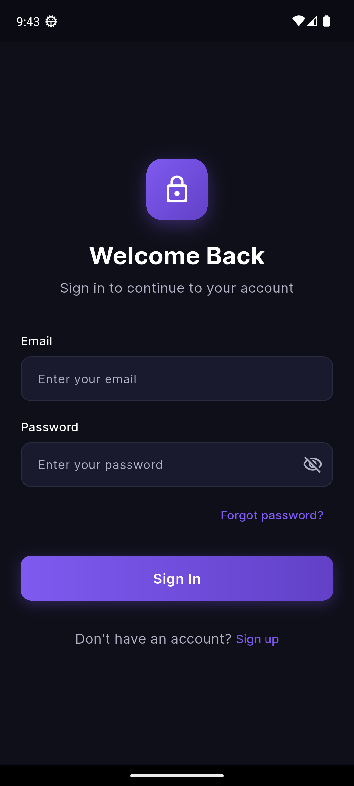

# Flutter Login Screen

A responsive, dark-mode login screen built with Flutter, Clean Architecture principles, Cubit state management, and `flutter_screenutil`.

## Objective

Build a polished, production-ready login UI that demonstrates:

- **Dark Theme Aesthetics**: Sleek dark color palette with cohesive typography and subtle visual depth.
- **Clean Architecture**: Domain-agnostic presentation layer cleanly divided into `cubit`, `pages`, and `widgets`.
- **Responsive Design**: Standardized screen adaptation using `flutter_screenutil` with capped max-width behavior for wide viewports.
- **Form Validation**: Strict email format and password rules managed via dedicated helper utilities.
- **Cubit State Management**: Predictable, immutable state flow separating state and business logic from UI rendering.

## Folder Structure

```
lib/
├── core/
│   ├── theme/          # AppColors, AppTextStyles, AppTheme
│   └── utils/          # Shared validators (email, password)
├── features/
│   └── auth/
│       └── presentation/
│           ├── cubit/      # LoginCubit and LoginState
│           ├── pages/      # LoginPage screen
│           └── widgets/    # Reusable auth components (AuthHeader, CustomButton, CustomTextField)
└── main.dart               # App entry point with ScreenUtilInit
```

| Folder / File Path | Purpose |
|-------------------|---------|
| [lib/core/theme/](file:///d:/Flutter/login_screen/lib/core/theme/) | Centralized dark color palette (`AppColors`), responsive typography constants (`AppTextStyles`), and MaterialApp ThemeData builder (`AppTheme`). |
| [lib/core/utils/](file:///d:/Flutter/login_screen/lib/core/utils/) | Input validation helpers (`Validators`) for email and password field validation. |
| [lib/features/auth/presentation/cubit/](file:///d:/Flutter/login_screen/lib/features/auth/presentation/cubit/) | State management layer holding `LoginCubit` and `LoginState` for async login simulation, status changes, and password visibility toggling. |
| [lib/features/auth/presentation/pages/](file:///d:/Flutter/login_screen/lib/features/auth/presentation/pages/) | Main page screen (`LoginPage`) orchestrating responsive form layout and Cubit state consumption. |
| [lib/features/auth/presentation/widgets/](file:///d:/Flutter/login_screen/lib/features/auth/presentation/widgets/) | Reusable UI widgets: `AuthHeader` (branding icon & header text), `CustomButton` (full-width button with progress indicator), and `CustomTextField` (styled input field). |

## How to Run

### Prerequisites

- Flutter SDK (3.9+)
- Dart SDK

### Installation & Execution

```bash
# Fetch dependencies
flutter pub get

# Run the app locally
flutter run
```

## Screenshots

| Mobile Viewport (<600px) | Wide / Tablet Viewport (>600px) |
|:------------------------:|:------------------------------:|
|  |  |

## Architecture Notes

### Why this folder structure?
The codebase follows **Clean Architecture** conventions by organizing code by feature and layer:
- **`core/`** isolates cross-cutting concerns (theming, validation) that can be shared across multiple features.
- **`features/auth/presentation/`** encapsulates all presentation logic for authentication. This allows future expansion into `domain/` and `data/` layers without touching existing UI components.

### Why split widgets into reusable components?
Extracting `AuthHeader`, `CustomButton`, and `CustomTextField` ensures:
- **Single Responsibility**: Each widget manages only its immediate layout and rendering.
- **Reusability**: Auth headers, text fields, and primary buttons can be re-used across registration, reset password, and onboarding screens.
- **Testability & Maintainability**: Smaller widget trees make unit and widget testing straightforward and decrease cognitive load.

### Why Cubit?
[Cubit](https://bloclibrary.dev/#/coreconcepts?id=cubit) offers a lightweight, state-driven model for UI presentation logic. It provides deterministic state transitions (`LoginInitial`, `LoginLoading`, `LoginSuccess`, `LoginFailure`) and manages UI flags (like password visibility) cleanly without requiring local widget state mutations.

### Why `flutter_screenutil`?
Using `flutter_screenutil` standardizes responsive scaling across varied device sizes. Scale extensions (`.w`, `.h`, `.sp`, `.r`) guarantee consistent proportions, readable typography, and identical visual balance on both compact phone screens and large wide displays.

## Dependencies

| Package | Purpose |
|---------|---------|
| `flutter_bloc` | Cubit state management |
| `equatable` | Value equality for immutable state objects |
| `flutter_screenutil` | Responsive design scaling |
| `google_fonts` | Inter typography font loading |

## License

This project is for demonstration purposes.
